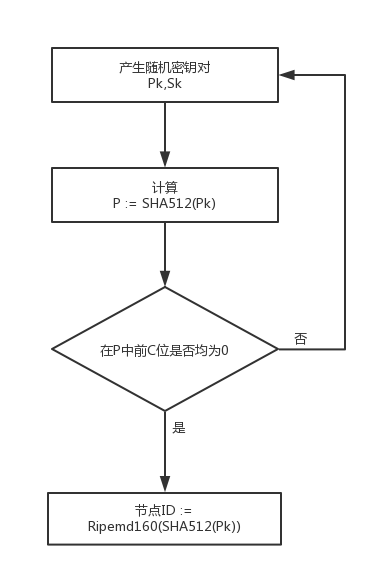

# 节点
在Karma网络中无论是何种设备以何种方式接入网络，也无论设备的计算能力强弱，只要设备具有网络数据收发能力，能够采集外界信息，执行网络指令或进行数据分析等操作，均可以作为节点存在。在Karma网络中节点不需要拥有于用户交互的输入设备，但是要保证至少拥有物理重启与物理重置功能的按钮。

## 节点ID
Karma网络中每个节点在第一次接入网络时会为自己产生一个长度为160位的节点ID，这个ID是由节点`ED25519`公钥经过哈希得到。节点在网络中通过ID相互寻址以及发现。节点ID在实现时会进行轻量级PoW来防止节点批量产生虚拟地址。具体节点ID产生算法由下图表示：

## OEM信息
节点的固件在编译时会被预先写入一些信息，这些信息中记录了节点厂商的信息，以及用于后期OTA升级的厂商公钥。这些信息包括：

1. OEM预置公私钥对
2. OTA公钥
3. 版本信息
4. 厂商信息

## 节点密钥对
节点中存在使用`ED25519`算法生成用于数字签名的公私钥对。其中公钥在传输过程中会传递给其他节点，私钥由节点自身保管，此私钥应临时生成，保证其安全。

## 节点状态
节点作为一个物联网网络设备在其工作时有多种不同的状态，处于不同状态的节点执行不同的操作，拥有不同的行为。
- `Preboot` 从未进入过网络或被重置过的节点处于此状态。此状态仅在出厂后或在节点被物理重置之后才会发生。在此状态的节点等待用户的手动引导。
- `Booting` 当一个节点已经进行过手动引导，在下次上电运行时即处于此状态。此时节点进行数据更新与一部分网络同步。
- `Running` 当节点正常运行时处于此状态，此时节点接受来自网络的请求与数据，处于正常运行状态。

## 手动引导
当节点刚出厂或手动重置后需要用户使用一个已经位于网络中的设备进行引导，这个设备往往是智能手机等便携智能设备。

## 网络同步
节点在处于 `Booting` 状态时节点会执行kademlia算法的节点引导过程，探测网络环境，更新节点路由表等行为。此时节点需要屏蔽掉所有外设，等待网络同步完成。

## 节点运行
节点处于运行状态时会接受来自外部各种请求信息，响应本地外设等，响应请求，同时调用底层资源用于调取数据。
